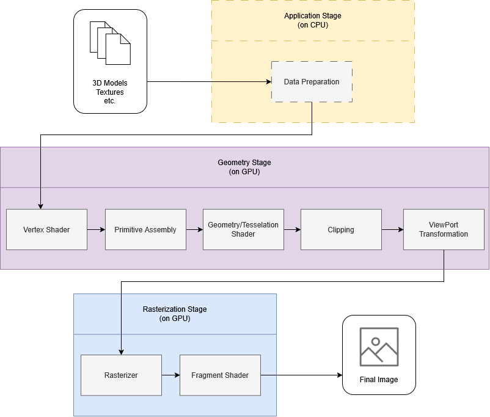
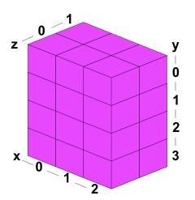
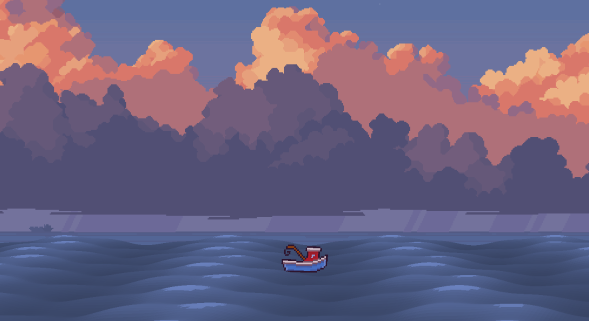

# WebGPU

In this project I take a look at WebGPU, a modern GPU API for the browser.
The first chapters introduce you to the world of GPUs and GPU computing, which can be quite complex and confusing when first learning about this topic.
After that, I take a look at the WebGPU architecture, the API structure and compare WebGPU briefly to its predecessor, WebGL.
With a short introduction to WGLS, WebGPU's custom shading language, the code-heavy parts begin.
First I show the classic beginner program every graphics programmer starts with, Hello Triangle.
Then, because simple tutorials like *Hello Triangle* do not convey how a technology is actually used or how real problems are solved with a technology, I also describe the small\* demo I've created. In the demo you are a boat, and you can swim to the left and right and also throw out your fishing rod.

> \* As you will see, small is a relative term. The feature set of the demo is small but its codebase is not.


> Footage of the demo project created in order to take a look at WebGPU

## Content

- [How does a GPU work](#how-does-a-gpu-work)
- [Pipelines](#pipelines)
    - [Graphics Pipeline](#graphics-pipeline)
    - [Compute Pipeline](#compute-pipeline)
    - [Workgroups](#workgroups)
- [WebGPU Architecture](#webgpu-architecture)
    - [Example Rendering](#example-rendering)
- [WebGPU as successor to WebGL](#webgpu-as-successor-to-webgl)
- [WebGPU Shading Language](#webgpu-shading-language)
- [Hello Triangle](#hello-triangle)
- [WebGPU Compute shader]()
- [WebGPU for developing games](#webgpu-for-developing-games)
    - [ECS - Entity Component System](#ecs---entity-component-system)
    - [Subdivision with Compute Shaders](#subdivision-with-compute-shaders)
- [Where to use WebGPU](#where-to-use-webgpu)
- [Final words](#final-words)
- [Demo](#demo)


## How does a GPU work 
> **Note:** In this document the terms 'GPU' and 'Graphics card' are used interchangeably, even if the GPU technically only describes the chip soldered to the Graphics card, which also contains Memory, a Heat sink, fans etc.    

To understand WebGPU, its goals, and its design decisions, we first need to understand the difference between a CPU and a GPU.
The CPU (or Central Processing Unit) is often compared to the brain of a human. The CPU can calculate a variety of different things and can handle data in many different forms.
It can run arbitrary code with incredible speeds. Modern CPUs like the AMD Ryzen 9 7900X have clock speeds of more than 5 GHz on 12 CPU cores.
As a stark contrast, a modern top-of-the-line GPU (or Graphics Processing Unit) like the Nvidia RTX 5090 has a clock speed of around 2 GHz but contains around 21.760 cores to process data.
But there is a catch.
While the CPU cores are very versatile and can work independently, the GPU cores can (most of the time) only do special calculations and need to run in groups with the same code.
But because GPUs are originally designed to do graphics programming tasks, this is not a drawback.
In graphics programming you often need to do simple operations very often.
Consider coloring in a Full-HD image.
For that you need to determine the color of each pixel and write it into a buffer, which is then displayed.
With that, you would already have about 2 million operations just to write the correct color into the color buffer.
Doing this sequentially can take a long time (in compute terms).
Doing this parallel with multiple threads / cores can lead to problems because threads need to acquire locks to safely interact with each other.

To tackle this issue, every GPU uses a simple trick: Just don't use locks but use context and trust the developer to write code that does not interfere across threads / cores.

All those 2 million operations to calculate a color and write to the same buffer are independent from each other, even if they are using the same resources.
We know that the color buffer has a place for each pixel, so we can just trust the program executed on the GPU that it will only write its pixel information to its designated location in the buffer and execute the calculations of each pixel in parallel. 

The key takeaways are that the GPU has way more, but much simpler, cores than a CPU.
The GPU can also do many things in parallel without thinking about locks or semaphores because the GPU's architecture allows its different cores to access the same resources in parallel.
But how exactly are GPU calculations being performed? How can a programmer define what a GPU should do and on what data?
For that, we have to take a look at the architecture of GPU APIs, which communicate with the hardware to allow calculations to be run on the GPU.

## Pipelines
To do calculations on a CPU, you just "throw" operations and data at the CPU, and it does its magic and returns you the result.
The GPU, on the other hand, first needs to be configured so it knows exactly what kind of data comes in and what to do with this data.
But once the GPU is configured, it can handle massive amounts of data.
This data-driven compute model is called a pipeline.
If you have defined a pipeline, you can just push data in on one end and get the expected result on the other end at an incredible rate.
To illustrate the data-driven / throughput-driven architecture of a GPU, consider the following:

A modern CPU has memory access speeds in the tenths of gigabytes per second.
Using DDR5-5600 RAM you can, for example, expect transfer rates of about 70 GB/s.
A modern GPU, on the other hand, has transfer speeds measured in terabytes per second.
The NVIDIA RTX 5090 can read up to 1.8 TB/s from its internal GDDR7 VRAM.

> **Note**: This example compares system memory with graphics memory and does not consider caches in any way or form. This is because caches do not effect the maximum transfer rates of memory.

There are two types of pipelines within WebGPU which will be looked at. 


### Graphics Pipeline
The main task of a GPU is the transformation of a 3D scene into a 2D image to be shown on a screen.
We will take a look at the traditional rasterization pipeline, which is still used in most of the 3D applications running in real-time today.
We will not look into Ray-/Pathtracing.
To convert a 3D scene into a 2D image, data needs to be transformed in many different ways.
For that there is the graphics pipeline, which describes exactly what and when which calculations are performed on the data.
In the case of the graphics pipeline, you enter data like 3D models, textures, materials, lighting information, viewport size, etc., and the result is a 2D image.


The graphics pipeline consists of different stages but can be categorized into three different parts.
The following image shows the different grouped stages of the render pipeline.



#### Application:
This stage prepares data to be send to the GPU.
In games this step includes tasks like collision detection, physics simulation etc.
It's executed fully on the CPU, which is why it will not be examined here and is marked with dashed lines in the image above.

#### Geometry:
The geometry step is responsible for calculations regarding polygons and vertices.
The first sub-step is the **Vertex Shader**, a GPU program defined by the developer to do various different tasks.
It takes vertices as input, often consisting of 3D position, normal data, and texture coordinates.
The vertex shader transforms the vertex data to move objects from model space to world space.
It’s essentially the act of “placing” a 3D object into a scene with multiple objects relative to a world origin.
After that, each vertex in the “world” is transformed based on the camera. That means that if you are looking around in a video game, it’s not you that is rotating and moving, but rather the whole universe around you (the camera), and you are perfectly still.

The output of the vertex shader are still only vertices.
The next substage, the **Primitive Assembly**, then creates primitives such as triangles and lines.

Those are fed into **Geometry / Tesselation** Shaders.
These special shaders can create new geometry by, for example, subdividing big triangles into smaller triangles.
Because the Geometry / Tessellation shader comes after the vertex shader, creating new vertices in those steps doesn’t come with a hefty performance penalty.
WebGPU does not support Geometry nor Tessellation shaders.
That’s why I won’t dive any deeper, even if they are very interesting.

A very nice example of what tessellation can look like and how powerful it can be can be found [here](https://www.youtube.com/watch?v=p_VpAMaxwpY). 
While **Geometry** / **Tesselation** steps are optional, the last two steps of the Geometry Stage are not.

The **Clipping** stage removes all primitives outside the camera frustum, so “you don’t get what you don’t see.”
And the last geometry stage, the **Viewport Transformation**, prepares the geometry data for the Rasterization by projecting the vertices onto the viewport plane.

#### Rasterization:
The rasterization stage uses the data from the Geometry stage to compute the color values of each pixel in the final image.
The first substage, the **Rasterizer**, takes the projected vertex data and generates fragments (often equal to pixels).
Each fragment is assigned different interpolated values, calculated from the three vertices from the original corresponding triangle.
Those interpolated values represent the input to the next substage, the Fragment Shader.

The **Fragment Shader** determines the color of the fragments, which again are typically 1:1 mappings to pixels.
Within the Fragment Shader the developer can, for example, read from texture data or calculate lighting information to determine what color a pixel should be.

That’s it! As you can see, a lot of heavy lifting has to happen to be able to render a 3D scene into a 2D image.

### Compute Pipeline
Besides rendering images, modern GPUs are often used for AI related tasks.
The reason is that rendering and AI tasks share fundamentals: float matrix calculations.
While rendering needs those to, for example, transform and translate the position of objects in 3D space or do projections to reduce the dimension of data, in AI tasks, matrix operations are used for linear transformations used in nearly every modern AI model today.
For calculations not related to graphics programming, a whole different, much simpler pipeline is used, the Compute Pipeline.

The Compute Pipeline is so simple that it only consists of one part, a GPU program called Compute Shader.
A Compute Shader takes an arbitrary input and returns an arbitrary output.
For example, it's easily possible to create a Compute Shader that takes an array of floats and returns an array where each float is doubled.
More on compute shaders later.

Those differences between the CPU and GPU and how the different pipelines are structured are fundamental to understanding WebGPU.
In later sections we will take a look at how WebGPU makes use of those pipelines and what to expect when trying to develop software using WebGPU.


### Workgroups
Because of the special GPU architecture, thread execution on the GPU is a little different from thread execution on the CPU.
While CPU threads can be dispatched in any quantity, GPU threads work within so called workgroups.

A workgroup is a 3D collection of threads that are run together and often share memory.
The defined workgroup size within a Compute Shader is static and can't be changed on the fly, only when creating a new Compute Pipeline.
A workgroup defined with size `(3, 4, 2)` can be imagined as a cuboid with sides as long as the dimensions: 



> Image from [https://webgpufundamentals.org/webgpu/lessons/webgpu-compute-shaders.html](https://webgpufundamentals.org/webgpu/lessons/webgpu-compute-shaders.html) 

The perfect size for a workgroup depends on the underlying GPU.
As an abstraction layer, WebGPU cannot infer the perfect workgroup size.
But modern GPUs are often constructed in a way that 64 threads are running in lockstep, which means that 64 threads are running exactly the same code at exactly the same time but only on different data.
This can vaguely be compared with SIMD instructions.
As with many things in graphics programming, the workgroup size can't just be set but has to be tested and chosen individually for each hardware configuration.
The size of 64 is a good starting point and should yield the best results in most of the cases.

But the workgroup size is not the only variable to tweak to be able to dispatch a massive amount of parallel running threads.
In fact, the workgroup size defines the lower bound on how many threads have to at least run to fulfill a task.
When dispatching a Compute Shader to the GPU, you also have to specify an amount of workgroups to dispatch.
You could, for example, call `dispatchWorkgroups(4,3,2)` to dispatch 4\*3\*2 = 24 workgroups, also defining a cuboid shape, which would result in 24 * 24 = 576 threads.

.png)

> Image from [https://webgpufundamentals.org/webgpu/lessons/webgpu-compute-shaders.html](https://webgpufundamentals.org/webgpu/lessons/webgpu-compute-shaders.html) 


Perhaps you are asking yourself: _Why make it so difficult and convoluted to run things in parallel?_

We already concluded that the workgroup size is dependent on the GPU architecture.
It's mainly bound to the memory layout and what data is processed in memory.
If we have, for example, just a 1D array of floats to process, a workgroup size of `(64, 1, 1)` could be valid.
On the other hand, if we have a 2D image to process, the size of `(8, 8, 1)` would be more fitting and much more performant.
This is because of the internal GPU memory layout, memory access patterns and address calculation.
This topic is extremely complex, but what to do can be reduced to one sentence: 

_Always fit the dimensions of the workgroup to the dimensions of the data/algorithm._

Okay, but why do we need to also define a 3D size when dispatching workgroups?
Why can't we just set the workgroup size to, for example, `(1024, 1024, 1)`?
This is because the workgroup size is limited to 256 threads, again because this number fits the GPU hardware pretty well.
But there are often tasks that could benefit from running on more than 256 threads.
For that, multiple workgroups need to be dispatched.
To still fit the dimensionality of the data/algorithm, the dispatching also happens to accept three dimensions.

The last thing I want to mention when talking about workgroups is overdispatching.
Because a workgroup has a fixed size, it's often not possible to only dispatch as many threads as actually needed.
Dispatching fewer threads is not possible because this means that data that needs to be processed is not processed.
Thus, the most common case is that more threads are dispatched as needed.
To ensure that those threads do not mess with memory or waste GPU resources, overdispatching protection needs to happen.

Even if we did not take a look at the WebGPU shading language yet, here is some code to point out overdispatching protection. 
In almost every compute shader program you can spot something along these lines:

```wgsl

@compute @workgroup_size(64, 1, 1)
fn main(
    @builtin(global_invocation_id) global_id: vec3<u32 >
) {
    let total_points: u32 = uniforms.totalPoints;

    // overdispatching protection
    if global_id.x > total_points {
        return;
    }
    
    // do the calculations
    ...
}
```

The thread ID describes the position of the thread inside the cuboid of all dispatched threads and identifies a thread uniquely. 
As you can see, overdispatching protection is just checking the thread ID to ensure that the current thread has work and is not out of the data bounds. 


## WebGPU Architecture
The workflow of WebGPU (and almost any other modern graphics API) is as follows:

First, you are specifying the pipeline to exactly instruct the GPU what data to expect in what stage and how exactly to process the data.
After that, you prepare the data to be uploaded on the GPU by bringing it into the correct format, which are often just byte arrays.
In the last step, you need to tell the GPU to execute a command, like drawing a triangle with a specified GPU pipeline.
Currently there are two different paradigms to handle GPU tasks.

The first is to have a global state machine like OpenGL and WebGL do.
This state machine is very easily configurable because each resource and API call is easily available everywhere.

On the other hand, there is the explicit definition of state which, for example, Vulcan and WebGPU use.
Having to define state via objects and structs enables the developer to have a more detailed control over what is actually happening inside the GPU.
But it comes at the cost of having to write more code and having to think more about the overall architecture the software has to have.
WebGPU tries to enable the developers to have a firm control over everything happening regarding the GPU while also keeping it simple.
For that, WebGPU also uses the object and structs approach and lets the developer handle state explicitly.
To accomplish tasks like rendering and computing, WebGPU offers many different interfaces in its API.
The general starting point of each WebGPU application is the `GPUDevice` which is responsible for interacting with the GPU.
The `GPUDevice` is an abstraction of all the tasks the GPU can perform.
It uses an `GPUAdapter` which is an abstraction of the actual hardware, and a `GPUCanvasContext` to render the output to.
The following tables show the different interfaces, used most commonly when working with WebGPU, categorized by their usage.


| Ressources |  |
| :---         |     :---      |      
| `GPUBuffer` | A block of memory to store data on the GPU    | 
| `GPUSampler`     | Description of how a shader has to transform / filter texture resources      |
| `GPUTexture`     | A special block of memory containing Textures to Sample from       |
| `GPUTextureView`     | A handle to a GPUTexture further specifying how to interpret and access the data       |

> Resources represent physical memory

| Encoders | |
| :---         |     :---      |      
| `GPUCommandEncoder`          |    Collects a sequence of GPU commands to be issued to the GPU      |      
| `GPURenderPassEncoder`          |    Groups commands related to Vertex/Fragment shader stages      |      
| `GPUComputePassEncoder`          |     Groups commands related to the Compute shader stage      |      

> Encoders collect GPU commands

| Pipelines | |
| :---         |     :---      |      
| `GPUComputePipeline`          |    Controls the Compute shader stage   |      
| `GPUPipelineLayout`          |    Defines the layout of a Pipeline by for example specifying what resources are used  |      
| `GPURenderPipeline`          |    Controls the Vertex/Fragment Shader stages  |      

> Pipelines describe the specific state of Compute and Render Pipelines

| BindGroups | |
| :---         |     :---      |      
| `GPUBindGroup`          |    Defines a bundled group of Ressources to be used in a shader   |      
| `GPUBindgrouplayout`          |    Defines the layout of a GPUBindGroup  |      

> BindGroups map between Resource-Slots, defined in Shaders, and actual resources like GPUBuffer and Texture   


| ShaderModule | |
| :---         |     :---      |      
| `ShaderModule`          |    Describes what to do in an shader Vertex/Fragment/Compute Shader stage   |


Many of those objects are created by calling the corresponding function on the `GPUDevice`.
Consider the following code:

```ts
const device  = navigator.gpu.requestAdapter()?.requestDevice()!;
...
const layout  = device.createBindGroupLayout({...});
const buffer  = device.createBuffer({...});
const texture = device.createTexture({...})

```
You can see a clear pattern.
To create anything related to the GPU, you have to use the correct function on the `GPUDevice`.
Each of those functions takes a configuration object as input, which describes how exactly your requested object should be configured.
In the case of the `createBuffer` function, the configuration could look like this: 

```ts
const buffer = device.createBuffer({
    size: 64,
    usage: GPUBufferUsage.UNIFORM,
    label: 'Global Uniform Buffer'
});
```
This creates a GPUBuffer with a size of 64 bytes and a specific usage mode. 
The usage `UNIFORM` is used to be able to bind this buffer in a bind group.  
Each and every function expects an object with many different, partially optional, settings to create the correct GPU related object.

This makes the usage of the architecture very simple and uniform.

1. Create a configuration of how your requested object should look like
2. Request that object by calling the corresponding function from the `GPUDevice`
3. use the created object 

### Example Rendering
Let's take a look at the concept of how rendering is done on the GPU.

The most important concept is that in WebGPU you are not dispatching commands directly to the GPU but rather collecting a series of commands and then dispatching a list of things to do to the GPU.

The `CommandEncoder` encodes commands to be dispatched to the GPU.
Those commands are grouped into Passes, for example, a RenderPasses for opaque objects, a RenderPass for transparent objects, or ComputePasses.
Each pass is recording corresponding GPU commands like setting correct resources and configurations, binding data, and doing `draw` calls.
The `draw` call instructs the GPU to actually do the calculations to draw the specified amount of triangles to the screen by pushing the corresponding data through the pipeline.
By calling the `finish()` function on the `CommandEncoder` a buffer containing all those instructions for the GPU is created.
To actually instruct the GPU to do the defined calculations, the `CommandBuffer` has to be written to the `GPUCommandQueue`.
In code this can look something like this, often being spread amongst multiple files responsible for different RenderPasses. 


```ts
const commandEncoder = device.createCommandEncoder();

// renderpass with all its configurations and the draw call
const passEncoder = commandEncoder.beginRenderPass({...});
passEncoder.setPipeline({...});
passEncoder.setBindGroup({...});
passEncoder.setVertexBuffer({...});
passEncoder.draw({...});
passEncoder.end();


const commandBuffer = commandEncoder.finish();
device.queue.submit([commandBuffer]);

```

## WebGPU as successor to WebGL
Before we take a look at WebGPUs custom Shader language, let's compare WebGPU to its predecessor, WebGL.
As previously mentioned, the biggest difference is the API's architecture and the functionality.
Consider the following code to set up WebGPU and clear the canvas: 

```ts
async function setupWebGPU() {
    if (!navigator.gpu) {
        return;
    }

    const canvas = document.createElement('canvas');
    const context = canvas.getContext('webgpu');

    const adapter = await navigator.gpu.requestAdapter();
    const device = await adapter.requestDevice();
    
    const presentationFormat = navigator.gpu.getPreferredCanvasFormat();
    
    context.configure({
        device,
        format: presentationFormat,
    });

    // record commands with commandEncoder
    const commandEncoder = device.createCommandEncoder();
    const passEncoder = commandEncoder.beginRenderPass({
        colorAttachments: [{
            view: context.getCurrentTexture().createView(),
            loadOp: 'clear', 
            clearValue: { r: 0.1, g: 0.2, b: 0.8, a: 1.0 }, 
            storeOp: 'store',
        }],
    });
    passEncoder.end();
    
    // dispatch all recorded commands async to the GPU
    const commandBuffer = commandEncoder.finish();
    device.queue.submit([commandBuffer]);
}
```
As seen in a previous code snippet, WebGPU collects all GPU commands with the `GPUCommandEncoder`and dispatches all commands to the GPU simultaneously.
This is done because WebGPU is designed to be async.
As previously mentioned, WebGPU does not have a global state machine, it instead lets you define structures and objects that describe exactly what the GPU has to do.
Instead of directly executing tasks, WebGPU forces the user to 'record' all actions in the correct order with all corresponding properties.
Those recorded actions are then dispatched together to the GPU queue, which works asynchronously. 
This allows the application to record different commands in parallel, boosting the CPU performance.
But more importantly, it eliminates the waiting of the CPU for the GPU to render.
After the submission of the list of commands to the GPU queue, the CPU can directly start to crunch data for the next frame.

On the other hand, consider the same task in WebGL, initiating the renderer and clearing the canvas.
```ts
function setupWebGL() {
    const canvas = document.createElement('canvas');
    const gl = canvas.getContext('webgl2');

    if (!gl) {
        return;
    }

    gl.viewport(0, 0, canvas.width, canvas.height);
    gl.clearColor(0.1, 0.2, 0.8, 1.0); 
    gl.clear(gl.COLOR_BUFFER_BIT);
}
```

As you can see, WebGL is very simple.
After the `gl` context is received, you can just call the necessary functions on this context and the action is performed immediately on the GPU.
The `gl.clear(...)` function, for example, clears the canvas with the specified color, previously set with `gl.clearColor(...)`.
The main problem with WebGL is that when calling a function like `clear` or `clearColor` the CPU has to read and write the global state and then communicate with the GPU driver to execute the command.
This can hurt performance, especially when there are many commands.
If a 3D scene has hundreds or even thousands of different draw calls because it has many different textures and materials, this can lead to overhead and long idle times for the CPU, where compute resources are wasted.
WebGL needs to be used synchronously because it has a global context consisting of one big state machine, which needs to be configured correctly before doing a draw call.
If multiple threads were to access this state machine in parallel, WebGL could not guarantee that when a draw call is dispatched, that all configurations are still correct.

This makes WebGPU way more feasible for applications where the CPU usage is critical.
While WebGPU's async style is way more efficient, it clearly has the disadvantage of having to write more boilerplate code and manage state by yourself.
This aligns with other modern graphics APIs, which influenced WebGPU and where no state machine is used.
Vulcan, for example, is famous for its 1000 lines of boilerplate code to render a single triangle, but it is also famous for being extremely performant.

The following code is a direct example of the different approaches between WebGL and WebGPU.
While WebGL uses just functions to configure the WebGL state machine and to do tasks, WebGPU configures objects with explicit context and works asynchronously with a task queue on the GPU:

```ts
// WebGLu
gl.clearColor(0.1, 0.2, 0.8, 1.0); 
gl.clear(gl.COLOR_BUFFER_BIT);

// WebGPU
const passEncoder = commandEncoder.beginRenderPass({
    colorAttachments: [{
        view: context.getCurrentTexture().createView(),
        loadOp: 'clear', 
        clearValue: { r: 0.1, g: 0.2, b: 0.8, a: 1.0 }, 
        storeOp: 'store',
    }],
});
passEncoder.end();
device.queue.submit([commandEncoder.finish()]);
```
> **Note:** While WebGL has an explicit `gl.clear()` call, WebGPU calls the `clear` function to he start of every frame / renderpass automatically 

Besides the architecture being focused on being async, WebGPU also has more/different features than WebGL.
The biggest feature is the support of general purpose computing on the GPU, also called Compute Shaders.
More on them later.
First, let's look at the new programming language WebGPU introduces to write GPU programs, because it does not use the older GLSL (OpenGL Shading Language), which WebGL and OpenGL use.

## WebGPU Shading Language
WebGPU uses WGSL (WebGPU Shading Language, pronounced 'wig-sull'), which is an abstraction language to be able to be compiled to other intermediate languages for Graphics APIs like SPIR-V (Standard Portable Intermediate Language), DXIL (DirectX Intermediate Language) and MSL (Metal Shading Language).
WGSLs syntax is influenced by Rust and Metal Shading Language, Apple's own shading language for Apple's GPU framework called Metal.
WGSL is, like other shading languages, strictly typed to provide the most information to the compiler possible.
Those types include `bool`, `i32`, `u32` and `f32` but also two, three, and four dimensional vectors `vecN<T>` and matrices `matNxM<f32>` where `N` and `M` must be from {2,3,4}. 
With `let` and `var` there are immutable and mutable modifiers for variable declaration.
Keywords to change the control flow include `if`, `switch`, `for`, `while` and `loop`, but also `break` `continue` and `return`.
WGSL allows for function definition and function calling.
Like other shading languages, there are many functions already implemented.
For example, functions like `sin`, `max`, `ceil` or `normalize` which are functions essential for writing shaders.

A simple WGSL function to be used in a game of life simulation could look something like this: 

```wgsl
fn countNeighbors(x: u32, y: u32) -> u32 {
  return getCell(x - 1, y - 1) + getCell(x, y - 1) + getCell(x + 1, y - 1) + 
         getCell(x - 1, y) +                         getCell(x + 1, y) + 
         getCell(x - 1, y + 1) + getCell(x, y + 1) + getCell(x + 1, y + 1);
}
```
> **Note**: `getCell` is also a custom function returning the aliveness value of an cell at `x`,`y`

In the example above, you can easily see the influence of Rust on the syntax.
Defining functions with the `fn` keyword and adding type information with `: T` is typical to Rust. 

To further define context for the compiler, there are also many different annotations, marked with an `@` symbol, like `@vertex` for marking a function as the entrypoint for a vertex shader and `@fragment` or `@compute` to mark a function as a entrypoint for a fragmant or compute shader.

The following table shows annotations with explanations and examples that I used in this project. 


| Annotation | Description | Example | 
| :---         |     :---      |       :---      |
|  `@group`    | defines the bindgroup of a resource |`@group(0) @binding(0) var<storage, read> in_data : f32;`|
|  `@binding`    | defines the position inside a bindgroup | `@group(0) @binding(0) var<storage, read> in_data : f32;` |
|  `@location`    | defines the position of in-/output of a shader | `struct Data {@location(0) position : vec4f}` |
|  `@builtin`    | specifics that a variable comes from a built-in feature of WebGPU | `@vertex fn vs1(@builtin(vertex_index) id: u32)` |
|  `@vertex`    | Entrypoint for Vertex Shaders | `@vertex fn vs1()`|
|  `@fragment`    | Entrypoint for Fragment Shaders | `@fragment fn fs1()` |
|  `@compute`    | Entrypoint for Compute Shaders | `@compute @workgroup_size(8,8)` |
|  `@workgroup_size`    | Sets the size how many threads are in a workgroup in a compute shader | `@compute @workgroup_size(8,8)` |

As you can see, some attributes are often combined with other attributes, like `@compute` defining a compute shader and `@workgroup_size` specifying the number of threads for this compute shader. 

Two other attributes used together are the `@group` and `@binding` attributes.
If you, for example, have a shader that expects one bind group with two properties, `in_data` and `out_data` then your shader code has to contain something along these lines: 

```wgsl
@group(0) @binding(0) var<storage, read>       in_data  : array<f32>;
@group(0) @binding(1) var<storage, read_write> out_data : array<f32>;
```

In this example there are two variables defined, two arrays containing only `f32` numbers.
Both arrays are bound in the same bindgroup (`@group(0)`), and inside the pointed brackets is also defined how the data is accessed.
While `in_data` can only be read, `out_data` can also be written to.
Generally speaking, WGSL is not reinventing the wheel.
It’s just a shading language, used to define programs that will run on a GPU.
The only real architectural difference between other shading languages and WGSL is that WGSL focuses on safety via strict typing in combination with explicit declaration of access patterns (like defining if only read or also write access is needed) and a very strict resource binding syntax via `@group` and `@binding` annotations.
Because WGSL was designed to be run on the web, and thus it is to be expected that it has to run on a very heterogeneous set of compute devices, WGSL tries to minimize the interpretation space by being very explicit.

To learn more about WGSL visit [the WGSL documentation](https://www.w3.org/TR/WGSL/) which is about 350 pages of features and definitions of what WGSL offers.
This document is also great to always have open on the side while programming WebGPU shaders.

## Hello Triangle 
This chapter shows the most basic WebGPU application there is, the beginner's project for every graphics programmer, Hello Triangle!
In this example you can see the setup needed to create a WebGPU application and what is needed to render a red triangle on screen.

The following steps are also marked in the code:

1. Create the `GPUDevice` by using a Canvas and a `GPUAdapter`
2. Define the data to be rendered, in our case one triangle
3. Create a `GPURenderPipeline` describing what the code is in each stage (vertex/fragment) and how vertex data should be read (triangle-list). Also define how a shader should read data and where to expect it (shaderLocation:0)
4. Do the actual render loop each frame
    1. Record all GPU commands with a command encoder 
    2. Set the pipeline and data to process
    3. Draw the triangle by doing a draw call

```ts
import triangleVertWGSL from './shaders/triangle.vert.wgsl';
import redFragWGSL from './shaders/red.frag.wgsl';

// --- 1. initialize the GPUDevice with a canvas context and a GPUAdapter ----
const canvas = document.querySelector('canvas') as HTMLCanvasElement;
const adapter = await navigator.gpu?.requestAdapter();
const device = await adapter?.requestDevice();
const context = canvas.getContext('webgpu');

const devicePixelRatio = window.devicePixelRatio;
canvas.width = canvas.clientWidth * devicePixelRatio;
canvas.height = canvas.clientHeight * devicePixelRatio;
const presentationFormat = navigator.gpu.getPreferredCanvasFormat();

context.configure({
  device,
  format: presentationFormat,
});

// ---- 2. Define data ----
// data definition and GPUBuffer creation
let triangle = new Float32Array([
     0.0,  0.5, 
    -0.5, -0.5, 
     0.5, -0.5, 
  ]);
const vertexBuffer = device.createBuffer({
    size:triangle.byteLength,
    usage: GPUBufferUsage.VERTEX | GPUBufferUsage.COPY_DST
});

// write actual data into the buffer
new Float32Array(vertexBuffer.getMappedRange()).set(triangle);
vertexBuffer.unmap();


// ---- 3. Renderpipeline Creation ----
// create a renderpipeline with automatic layout detection
// explicitly define the input of the vertex stage as a buffer of 2D float vectors
const pipeline = device.createRenderPipeline({
  layout: 'auto',
  vertex: {
    module: device.createShaderModule({
      code: triangleVertWGSL,
    }),
    buffers: [
        {
            arrayStride: 2*4,
            attributes:[
            {
                shaderLocation:0,
                offset:0,
                format: 'float32x2'
            }]
        }]
  },
  fragment: {
    module: device.createShaderModule({
      code: redFragWGSL,
    }),
    targets: [
      {
        format: presentationFormat,
      },
    ],
  },
  primitive: {
    topology: 'triangle-list',
  },
});

// ---- 4. Renderloop ----

/**
 * This function is called each frame
 */
function frame() {
  // create a commandEncoder to collect all GPU commands for the current frame 
  const commandEncoder = device.createCommandEncoder();
  const textureView = context.getCurrentTexture().createView();

  // create a descriptor to define how data is treated in the renderpass
  const renderPassDescriptor: GPURenderPassDescriptor = {
    colorAttachments: [
      {
        view: textureView,
        clearValue: [0, 0, 0, 0], // Clear to transparent
        loadOp: 'clear',
        storeOp: 'store',
      },
    ],
  };

  // start to record GPU commands
  const passEncoder = commandEncoder.beginRenderPass(renderPassDescriptor);
  // set the pipeline which includes for example what shader the triangle should use
  passEncoder.setPipeline(pipeline);
  // draw one triangle from 3 vertecies 
  passEncoder.setVertexBuffer(0, vertexBuffer);
  passEncoder.draw(3);
  passEncoder.end();

  device.queue.submit([commandEncoder.finish()]);
  requestAnimationFrame(frame);
}

requestAnimationFrame(frame);
```

And here is the Vertex and Fragment Code:

```wgsl
// the vertex function is executed for each vertex, in our case three times.
// it takes a 2D vector and returns a 4D vector, normally there would be a converting step from world to camera space
@vertex
fn main(
  @location(0) position: vec2f 
) -> @builtin(position) vec4f {
  return vec4f(position, 0.0, 1.0);
}

// the fragment function is executed for each pixel to be colored
// here the color is RED (RGBA)
@fragment
fn main() -> @location(0) vec4f {
  return vec4f(1.0, 0.0, 0.0, 1.0);
}
```

In this example you can see that you need a lot of code to just render a single triangle on screen.
The code is also not very flexible and does not include any steps like converting vertex positions from local- to world- to camera space.
But it outlines the general workflow flow of WebGPU.
You need to first prepare data and define all processing steps.
Then you need to start recording the GPU commands. 
While recording, for each object to render (here only a single triangle) you need to set the correct RenderPipeline configuration, the correct data and dispatch a draw call.
Only after submitting the command queue, the GPU starts to execute all commands given to it.

This process feels tedious, but it's designed to be!
By not abstracting away many things and having "direct" contact with the GPU you have a very strong control on what exactly the GPU has to do.
In the world of graphics programming and real time rendering, this can make the difference between running with 30 or 144 frames per second.   

>**Note:** 144 frames per second is a common refresh rate for gaming monitors, while 30 frame a second is commonly agreed to be 'barely enough' to play a video game smoothly 

## WebGPU for developing games
To really get a feeling for WebGPU, I decided to create a very, very small tech demo with no actual gameplay.
The idea was to have a boat floating on water with a pretty background and to be able to cast a fishing rod and move left and right.
I choose those use cases because they can demonstrate what actual problems in game development can look like and how to solve them with a graphics API like WebGPU.
But first, allow me a brief detour.

### ECS - Entity Component System
Perhaps you, dear reader, know about the Model View Controller paradigm used everywhere in software development. MVC is mostly about decoupling and centered around presentation and controlling.
The biggest flaw (in terms of high performance computing for games) of MVC is the memory layout. A typical model class, like a player, contains many different data points, which are often stored side by side. Acting on those models requires the loading of their data into the CPU.
Because of the CPU and memory architecture, there will be data fetched and cached that is not needed.
The problem gets even worse if you consider CPU branch prediction and ahead of time caching.
MVC systems can be very unpredictable when it comes to the memory usage patterns, especially when many indirections are used.

To tackle this problem, modern game titles are using an Entity Component System, or ECS. 
It consists of three parts: 

**Entities** are just identifiers, which are represented as strings or, most of the time, just numbers.

**Components** describe properties of entities like a position in 3D space, mesh data, animation data, etc. .
They are stored in minimal structures / classes with no functions.
Being minimal means that only data which is usually accessed together is actual stored together.
So, for example, the 3D position, the mesh data and the animation data, would all be stored in individual structs/classes. 
Every kind of component is then stored in its own map.

**Systems** take components as input and modify them. 

To better understand this, consider the following example:

There is a `PhysicsBodyComponent` and a `TransformComponent`.
The `PhysicsBody` has a `Velocity` while the `Transform` has a 3D `Position`.
We could create a `PhysicsCalculationSystem` which takes a `Map<number, PhysicsBodyComponent>` and a `Map<number,TransformComponent>`.
Then the system iterates over all `PhysicsBodyComponents`, also queries the corresponding `TransformComponent` and calculates a new `position` and updates the `TransformComponent`.
In code this could look something like this: 

```ts
class PhysicsCalculationSystem {
  update(
    translates : Map<number, TransformComponent>,
    physicsBodies : Map<number, PhysicsBodyComponent>
  ){
    for(var [id, physicsBody] of physicsBodies) {
      let translate = translates.get(id);

      if(!translate){
        continue;
      }

      translate.position = translate.position + physicsBody.velocity;
    }
  }
}
```
> **Note**: the actual calculation for applying a velocity may differ

This code has a huge advantage: the memory layout is data oriented, allowing much higher CPU throughput rates and bypassing CPU bandwidth bottlenecks because only data that is actually used is loaded.
Another neat feature of this memory layout is that systems act on a whole array, making CPU caching and branch prediction much simpler and more efficient.
With such a predictable layout, SIMD operations, for example, can be more easily used by the optimizer.
For those reasons, Entity Component Systems are the de facto standard for modern data intensive applications in Realtime Graphics / Gaming.
But because this document is about WebGPU and not game engines, I won't bother explaining exactly how non WebGPU related code works in detail.
One thing you should have in mind is the idea of composition over inheritance.
Adding properties and data by just creating components and linking them to entities works great with the more resource oriented WebGPU API than with other statemachine oriented APIs like WebGL.
Furthermore, this allows for the aforementioned advantages.

> The data oriented approach is actually the same idea which drives Column oriented Database management systems, allowing them to outperform Row oriented DBMSs in terms of complex read intensive queries

End of detour.

With that out of the way, we can also understand what role WebGPU takes when developing a game.
There should be a `RenderSystem` having all data related to rendering as input.
Then this system should configure the `GPURenderPipeline` as needed and dispatch data and commands to the GPU.
Data used for rendering can be stored in a component.
The component I developed for this example is defined as follows: 

```ts
class MeshRenderComponent {
    material: Material;

    // mesh data
    meshVAO: GPUBuffer;
    vertexCount: number;

    // indexed rendering 
    indexed: boolean
    indexBuffer: GPUBuffer | null;
    indexCount: number;

    constructor(material: Material,
        meshVAO: GPUBuffer,
        vertexCount: number,
        indexed: boolean = false,
        indexBuffer: GPUBuffer | null = null,
        indexCount: number = 0) {

        this.material = material;
        this.meshVAO = meshVAO;
        this.vertexCount = vertexCount;

        // optional indexed rendering
        this.indexed = indexed;
        this.indexBuffer = indexBuffer;
        this.indexCount = indexCount;
    }
}
```

The component contains mesh data, dispatchable to the GPU.
It also contains a material, which defines GPU resources, for example, the color and shader module to use to render the material.

The actual update function of the `RenderSystem` looks like this: 
```ts
update(commandEncoder: GPUCommandEncoder,
    instanceBuffer: GPUBuffer,
    opaqueBatches: RenderBatch[],
    currentTextureView: GPUTextureView,
    dsAttachment: GPURenderPassDepthStencilAttachment): void {

    const renderPassDescriptor: GPURenderPassDescriptor = {
        colorAttachments: [{
            view: currentTextureView,
            loadOp: 'clear',
            storeOp: 'store',
            clearValue: { r: 0.1, g: 0.2, b: 0.3, a: 1.0 },
        }],

        depthStencilAttachment: {
            view: dsAttachment.view,
            stencilLoadOp: 'clear',
            stencilStoreOp: 'store',
            depthLoadOp: 'clear',
            depthStoreOp: 'store',
            depthClearValue: 1.0,
        },
    };

    const passEncoder = commandEncoder.beginRenderPass(renderPassDescriptor);

    passEncoder.setBindGroup(0, this.globalBindGroup);

    // all batches
    for (const batch of opaqueBatches) {

        if (batch.indexed && batch.indexBuffer) {
            passEncoder.setPipeline(batch.pipeline);
            passEncoder.setBindGroup(1, batch.constantsBindGroup);

            if (batch.textureBindGroup) {
                passEncoder.setBindGroup(2, batch.textureBindGroup);
            }

            passEncoder.setVertexBuffer(0, batch.meshBuffer);
            passEncoder.setVertexBuffer(1, instanceBuffer);
            passEncoder.setIndexBuffer(batch.indexBuffer, GPUIndexFormat.Uint32);

            passEncoder.drawIndexed(batch.indexCount, batch.instanceCount, 0, batch.instanceOffset);
        }
        else {
            passEncoder.setPipeline(batch.pipeline);
            passEncoder.setBindGroup(1, batch.constantsBindGroup);

            if (batch.textureBindGroup) {
                passEncoder.setBindGroup(2, batch.textureBindGroup);
            }

            passEncoder.setVertexBuffer(0, batch.meshBuffer);
            passEncoder.setVertexBuffer(1, instanceBuffer);

            passEncoder.draw(batch.vertexCount, batch.instanceCount, 0, batch.instanceOffset);
        }
    }

    passEncoder.end();
}
```

Because of batching, instancing, and indexed rendering, the code is a little convoluted.
A batch is a group of renderable data that shares the same PipelineConfiguration.
Rendering in batches increases the performance of the GPU drastically because switching pipeline configurations costs a lot of time.
The code does the following things in order: 

1.	Create a CommandEncoder and begin a new Renderpass
2.	Bind all data that does not change between different batches within the time of the current frame (e.g. the current time or CameraPosition )
3.	For each batch, configure the pipeline as needed. This includes setting shaders, textures, and mesh layouts
4.	Upload geometry data by setting the vertex buffer (and index buffer)
5.	Dispatch an (indexed) draw call

This general purpose render pass can render all renderable and opaque entities in this demo.


### Subdivision with Compute Shaders 

Because one of the most valuable new features of WebGPU is the compute shader, I decided to also introduce a compute shader into the project.
For that, I decided to create a subdivision compute shader, which takes a single quad, consisting of four positions, and subdivides it into many smaller triangles to create more detail on the water surface.
Normally you would use a tessellation shader to dynamically add mesh details.
Unfortunately, WebGPU does not have a tessellation stage, thus, a compute shader has to be used.
Even if you are technically able to do anything you want in a compute shader, like tessellation, it has one drawback.
While tessellation is done after the vertex shader, the compute shader has to run before the vertex shader.
This has the consequence that if mesh data is enriched in detail and new vertices are created, the vertex shader has a lot more work to do.
But in the case of this small demo, this is not a problem.

The following code is a sample from the [subdivider.ts]() file, which contains the logic to dispatch the compute shader from [subdivision.wgsl]().

The example has two phases:

1. The GPU is instructed to do the computations with the specified compute pipeline and bind group.

2. The augmented data inside the GPU memory has to be written back into main memory to be able to be handled by the CPU 


```ts
// ##### COMPUTE PASS #####
let commandEncoder = this.device.createCommandEncoder();
const computePass = commandEncoder.beginComputePass({
    label: 'Quad Subdivision Compute Pass',
});

computePass.setPipeline(this.computePipeline);
computePass.setBindGroup(0, bindGroup);

// dispatch enough threads to handle all points on the grid
const workgroupSize = 8;
const dispatchX = Math.ceil(this.GRID_SIZE_X / workgroupSize);
const dispatchY = Math.ceil(this.GRID_SIZE_Y / workgroupSize);
computePass.dispatchWorkgroups(dispatchX, dispatchY);
computePass.end();
// ##### END COMPUTE PASS #####

commandEncoder.copyBufferToBuffer(
    this.outputPointsBuffer,
    0,
    this.readbackPointsBuffer,
    0,
    this.readbackPointsBuffer.size
);

commandEncoder.copyBufferToBuffer(
    this.outputIndexBuffer,
    0,
    this.readbackIndexBuffer,
    0,
    this.readbackIndexBuffer.size
);

this.device.queue.submit([commandEncoder.finish()]);

await this.readbackPointsBuffer.mapAsync(GPUMapMode.READ);
await this.readbackIndexBuffer.mapAsync(GPUMapMode.READ);

const arrayBuffer = this.readbackPointsBuffer.getMappedRange();
const arrayBufferIndex = this.readbackIndexBuffer.getMappedRange();

const resultPoints = new Float32Array(arrayBuffer).slice();
const resultIndex = new Uint32Array(arrayBufferIndex).slice();

this.readbackPointsBuffer.unmap();
this.readbackIndexBuffer.unmap();

```

The effect of this subdivision is clearly visible when experimenting with different subdivision sizes, as seen in the following images:


> Water with a 16x16 Subdivision (450 Tris)


> Water with a 64x64 Subdivision (7.938 Tris)


> Water with a 512x512 Subdivision (522.242 Tris)

Even with over half a million triangles, the demo still runs with the target framerate of 100 Frames a second.

## Where to use WebGPU
As seen, WebGPU is a high performance API, desigend to be a modern abstraction of a GPU, like Vulkan, but for the web.
WebGPU offers the bare minimum to do tasks like rendering and computing on the GPU.
This creates a problem when viewing WebGPU from the angle of fast-paced web development and prototyping.
Of course it's possible to create a really nice (and resource-efficient) webpage using WebGPU to do a "3D scroll effect" like on [this page](https://silencio.es/).
Or even to program games directly for the web, but that's not what WebGPU is targeting.

WebGPU is a modern foundation for other libraries like Three.js or Babylon.js.
Those libraries simplify many difficult concepts by hiding them behind simple to use abstractions.
One such case is material management.
Materials describe properties of 3D objects and how exactly those objects should be rendered.
Because WebGPU does not have the concept of materials built in, the developer needs  to do its own implementation of materials, its caching, and so on.
Libraries like Three.js already implement those difficult tasks so that a developer only needs to specify the properties of a material and Three.js automatically configures the render pipeline to correctly render the 3D scene with all different materials.
Also, tasks like the transformation from local to world to camera-space and the management and execution of different render passes with the correct render order are way simpler in Three.js. 

When looking at games in the browser, a similar picture arises.
It's way more important to have good tools to create and iterate fast than to have the fullest of control.
While you can create a game with WebGPU directly, game engines like Unity can compile to WebGPU.
Only in the rarest cases is it useful to use WebGPU directly.
The game demo I created in this project has about 3200 lines of TypeScript code.
A major part of this is controlling and managing resources.
A very similar game could be created in a few hundred lines of code by just using Unity and then compiling to WebGPU.

## Final words
WebGPU is a modernization of WebGL, the foundation for every 3D application running in the browser.
WebGPU is a boring technology!
It's boring because it can afford to be boring.
WebGPU does not need to have a user friendly, easy to use, and flashy list of functionalities like other web libraries and frameworks (e.g., React or Tree.js).
WebGPU is simply a very powerful and modern abstraction of the GPU, and most developers, especially "normal" web developers, will never even use it directly.
It is simple and powerful, but code gets very complex when trying to do the right abstractions yourself.

Perhaps you are asking youself: **Should I use WebGPU for X**? 
I can very confidently  say that you probably shouldn't.
The following use cases are the only ones I can think of where asking this question is valid: 

1. You are creating a 3D render library like Three.js
2. You don't want to have any dependencies
3. You need absolute control over everything happening on the GPU 
4. You want to learn about rendering and the GPU in general

Even if you are creating a 3D library or a high performance 3D application like a web based MRI viewer, you should at least consider using an abstraction to WebGPU like Three.js.
Libraries like Three.js are maintained by many very skilled people who know exactly what they are doing.
I would say the probability of creating an application directly with WebGPU having a better performance than a similar application created by using an abstraction layer like three.js is very small.
This is because every minuscule design decision can impact the performance of the final application in a major way.

Does this mean WebGPU is not usefull? 
NO! Quite the opposite. WebGPU is useful and long overdue.
It brings modern GPU programming to the web, but nothing more.
It will be forever a technology hidden behind brilliant abstractions, powering parts of the web without most people even noticing it.


# Demo 

If you want to see the demo in action, pull the repo, install a node environment with typescript and pnpm, run pnpm dev and open the browser...
or just visit my [Github Pages](TODO).

## Some things to notice
To create this demo I have coded many things which won't be noticed until you look at the code or have experience in the field of graphics programming. 
Here a quick list of features with their corresponding code files.
What I have created includes but is not limited to: 


- The concept of Materials and the management of those
A material contains everything needed to give a mesh its look. This includes textures, material properties, shaders and so on.

- Different renderpasses to render different parts of the scene like opaque objects, transparent objects and hud elements which are  using a orthogonal projection

- A system to render text 
Text is inherently hard to draw because there is no concept of text when rendering. 
You need to create a dynamic mesh on the fly which then gets a texture of the text.
For that you need to also have a font atlas which is just all letters and icons you want to have in your font in a texture. 

- A parallax effect in the background 
The parallax effect is done by splitting a background image in multiple layers and scrolling them at different speeds to create the illusion of movement and depth

- An animation system
animating the fishing line of the boat while swimming and fishing is done with a texture atlas.
Having a big texture which contains all animations of the boat and just choosing which part to render in which state, allows for lower GPU usage because textures do not need to be replaced and reuploaded to the GPUs memory.  

- Making procedural waves
To create waves on the ocean a vertex shader is used.
It calculates a y-offset based on the xz-position of the vertex.
Normally you would use noise (e.g. perlin noise) but here I am just using several overlaid sin functions.  

- Moving the boat with the waves
To move the boat with the waves the calculations from the vertex shader of the waves are also applied to the vertices of the boat.
To rotate the boat so that it swims up and down the waves a approximation of the slope of the current waves position is used to create a rotation matrix. All done in the vertex shader of the boat

- Coloring of the Water
To color the water the waters fragment shader uses the y-offset of the vertices.
There are two interpolations used. The flat interpolation ensures that the low parts of the water are dark and the high parts are bright while creating stylized low poly look.
To highlight the tops of the waves often having bright white foam in real life, a smooth interpolation is used. You can see the difference when observing the borders of the triangles.
While you can see the borders within the low part of a wave, you cant see borders in the foam part. The foam appears uniform and smooth.

I highly recommend you to also look at the code to see how much work is needed to do the most basic things most of us just take for granted when thinking of video games.

## Controls

| Input | Action |
| :---         |     :---      |      
| `A` & `D`           |    Move left and right   |      
| `F`          | Cast / Reel in the line  | 
| `C`          |  Toggle freecam | 

Besides the default controls there is also a freecam, used while debugging which is controlled as follows:

| Input | Action |
| :---         |     :---      |      
| `W`, `A`, `S`, `D`     | Fly in any direction |      
| `Q` & `E`          | Fly down and up  | 
| `Mouse`          | Look around | 
| `C`          |  Toggle freecam | 

There is also a **highly experimental** feature: 
While in **freecam** you can aim at an object and press the **left mousebutton** to select this object.
Then you can hold **shift** and move the mouse to move the object in the 3d scene.
This does NOT work on the water plane because it's subdivided at runtime. 